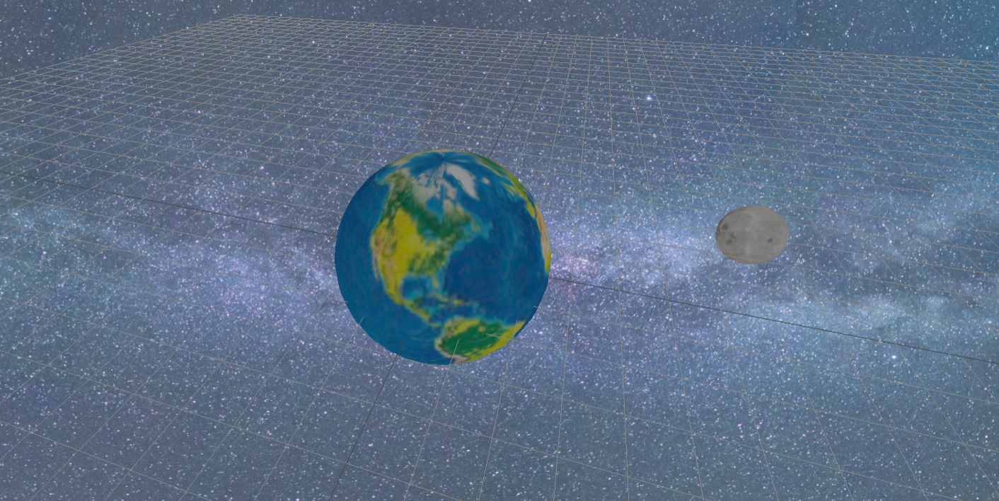

# Threejs Simple Demo

### Get Started
```
git clone https://github.com/Einsgates/ThreejsDemo.git
npm install
npm run dev
```
The moon the moon rotates around the earth and the earth rotates on its axis.

